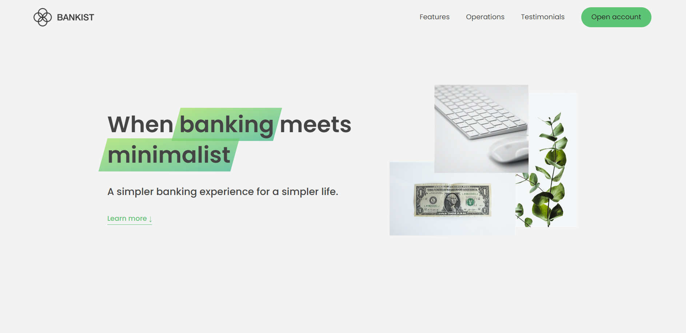
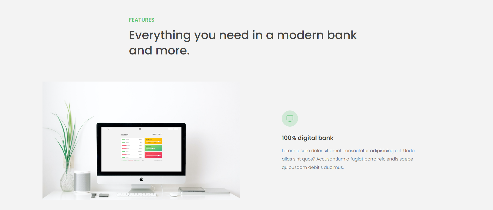
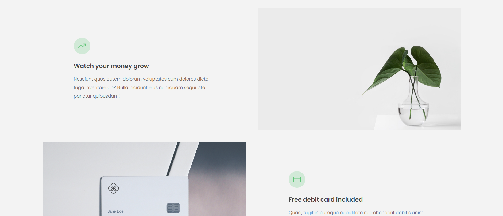

# 🏦 Bankist Landing Page [DESKTOP ONLY, NOT FULLY RESPONSIVE]
> Advanced DOM manipulation using vanilla JavaScript. A modern, interactive, and visually appealing banking UI project inspired by minimalist design principles.



> 
---

## 🛠️ Tech Stack

- **HTML5** – Semantic and accessible layout  
- **CSS3** – Custom styles with variables, gradients, and transitions  
- **JavaScript (Vanilla)** – DOM manipulation, events, tabbed components, sliders, modals  
- **Intersection Observer API** – Lazy loading images and reveal-on-scroll effects  
- **Responsive & Interactive UI** – Sticky nav, modal windows, smooth scroll, slider  

---
## 👀 Why This Project Stands Out

- Sleek, minimalist banking interface  
- Fully interactive elements: modal windows, tabbed operations, sliders  
- Smooth scrolling, sticky navigation, and lazy-loading images for performance  
- Clean design using custom CSS and Google Fonts (Poppins)  
- Demonstrates ability to follow tutorials and implement complex frontend functionality  

---

## 🧠 What I Learned

- Advanced DOM manipulation and event delegation  
- Implementing **lazy loading** and **Intersection Observer API**  
- Smooth scroll and sticky navigation implementation  
- Slider functionality with dots navigation  
- Translating tutorial knowledge into a polished, interactive frontend project  

> 📌 *This project was built by following Jonas Schmedtmann's JavaScript Course, which helped me understand modern frontend patterns, UI interactivity, and user experience enhancements.*

---


## ✨ Features

- Tabbed operations for banking features (transfers, loans, closing accounts)  
- Image slider with navigation dots  
- Lazy loading images for faster performance  
- Modal window for account signup  
- Smooth scroll navigation and interactive UI elements  
- Sticky navigation and section reveal animations  

---


## ⚙️ How to Run Locally

1. Clone the repository  
   ```bash
   git clone https://github.com/FrontEndHighRoller/Bankist-landing-page.git
2. Open index.html in your browser
3. Resize the screen to see responsive layouts and image switching in action 🎯

---

🏆 Challenge Credit
Challenge by Frontend Mentor
https://www.frontendmentor.io

---

🙋‍♂️ Author
Dennis Rumanek

GitHub: https://github.com/FrontEndHighRoller

LinkedIn: https://www.linkedin.com/in/dennis-rumanek/

⭐ If you like this solution, feel free to star the repository!
